<grid drop="5 20" drag="90 25" style="font-family:'Inter',sans-serif;background-color:#303030;border-radius:8px!important;padding:auto;align:center;">
# Scientific Data Science <!-- .element style="font-family:'Inter';color:#F8F8F8;" -->

#### An Emerging Symbiosis <!-- .element style="color:#9e9e9e;font-family:'Inter';font-weight:600;" -->
</grid>

<grid drop="0 55" drag="100 30" style="line-height:0.6em;" align="top">
Sam Foreman <!-- .element style="font-family:'Inter';font-size:1.6em;font-weight:500;line-height:0.6;color:#E0E0E0!important;vertical-align:bottom!important;" -->

May, 2022 <!-- .element style="font-family:'Nanum Pen Script'; font-size:1.8em;color:#616161;vertical-align:top;font-weight:400;" -->
</grid>

<grid drag="100 10" drop="bottom" flow="row" align="left" style="font-size:1.5em;">

::: block <!-- .element style="margin-left:2%;margin-bottom:2%;" -->

[<i class="fab fa-github"></i>](https://github.com/saforem2)
[<i class="fas fa-home"></i>](https://samforeman.me)
[<i class="fab fa-twitter"></i>](https://twitter.com/saforem2)

:::

</grid>

<grid drag="30 30" drop="70 70" align="bottomright">
</img>
</grid>

---

# Advanced Workflows
- Real-time data analysis
- APS Upgrade
- **Idea**:
    - Currently, much of science research is manually guided
        - Try new architecture, play with hyperparameters, repeat
    - Ideally, we would like to automate this
    - Hyperparameter optimization, [DeepHyper](https://deephyper.org), etc.

note:
- Physics + ML
    - Geometric Deep Learning
    - Heavily influenced by symmetry considerations
    - should be amenable to goemetric analysis

- Relatively easy to prototype / try new models 
    - esp on toy problems
- Typically the refinement stage is most involved

---

::: block <!-- .element align="center" style="font-size:0.9em;" -->

> Polaris is well equipped to help move the ALCF into the exascale era of computational science by accelerating the application of AI capabilities to the growing data and simulation demands of our users. **Polaris will also provide a broader opportunity to help prototype and test the integration of HPC with _real-time experiments and sensor networks_.**
>
> — Michael E. Papka, ALCF director [`[1]`](https://www.alcf.anl.gov/news/argonne-national-laboratory-and-hewlett-packard-enterprise-prepare-exascale-era-new-testbed) <!-- .element align=""="bottomright" -->

:::

<grid drag="90 0" drop="5 83" class="horizontal_dotted_line">
</grid>
<grid drag="90 10" drop="3 85" align="left" class="footer">
::: block

1. [Argonne National Laboratory and Hewlett Packard Enterprise prepare for exascale era with new testbed supercomputer Argonne Leadership Computing Facility](https://www.alcf.anl.gov/news/argonne-national-laboratory-and-hewlett-packard-enterprise-prepare-exascale-era-new-testbed)

:::
</grid>

---

# 🤔 Current Issues 

- Research publications are static
    - Mistakes are inevitable
    - Reproducibility issues are common
    - Versioning
    - Which code version made which reports?
    
- Jupyter Notebooks
    - Better
    - Still must be manually ran, cell by cell
    - Useful as a "playground" for:
        - testing ideas,
        - debugging code
        - making / fine-tuning plots

note:
- FAIR
- v1, v2.4, ..., v3-final-1, ...
- Prone to human error
- Dependencies evolve and become incompatible
- Depends on users making
- May not reflect most up-to-date changes

---

# Alternatives?

- Dynamic reports:
    - Grow and change over time (**alive**)
    - Present results **with context** seamlessly
    - Central hub for team
    - Arbitrarily customizable
    - Live-updating
    - Having dynamic "reports" that can grow and change

- Experiment tracking
    - [TensorBoard](https://tensorboard.org)
    - [Weights and Biases](https://wandb.ai)
    - [Neptune](https://neptune.ai/product)
    - [Comet](https://www.comet.ml/site/data-scientists/)

note:
- Empirical DL research + Scientific Research could be more effective with reports that are alive & with researchers adding to it
- Make sense of the countless recipes researchers have and move towards systematizing these ideas
- For DataScience team @ ALCF:
    - Centralized hub for:
        - Storing and versioning models from multiple projects
        - displaying real-time machine performance
- Share ideas / models with team
    - Borrowing / fine tuning

---

<grid drag="50 20" drop="top" align="center" style="margin-top:10%;">
 # 📊 ML Ops
</grid>

<grid drag="60 25" drop="center" align="center" class="note" bg="#66bb6a" style="text-align:left;">

    
**Goal**: Allow researchers to focus on their science / model development without all the boilerplate.

</grid>

---

<!-- .slide bg="white" -->

### MLOps

<grid drop="0 8" drag="100 92">

<iframe id="mlops" width="100%" height="100%" data-src="https://www.mlops.toys" data-preload data-background-interactive></iframe>

</grid>

---

<!-- .slide bg="white" -->
<grid drop="0 0" drag="100 100">
<iframe width="100%" height="100%" data-src="https://wandb.ai/l2hmc-qcd/l2hmc-qcd/reports/L2HMC-Report-04-04-2022---VmlldzoxNzgzODcx" style="border:none;width:100%" data-preload data-background-interactive></iframe>
</grid>

---

<!-- .slide bg="white" -->

<grid drop="0 0" drag="100 100">
<iframe width="100%" height="100%" data-src="https://wandb.ai/l2hmc-qcd/l2hmc-qcd/reports/W-B-Sweep-1024x16x16-4-nlf-8-TensorFlow---VmlldzoxNzA1MzU4" style="border:none;width:100%" data-background-interactive></iframe>
</grid>

---

### Distributed Training

---

 # Distributed Computing

 <grid drop="0 15" drag="48 100" align="topleft">

 
 </grid>

 <grid drop="40 15" drag="60 100" align="topright">

  <!-- .element align="stretch" -->
 </grid>

---

#### Identifying Phase Transitions [`[1]`](https://doi.org/10.1038/nphys4035)

<grid drag="90 90" drop="center" align="top" flow="col" style="margin-top:5%;">

</grid>

<grid drag="95 0" drop="3 92" align="left" class="horizontal_dotted_line">
</grid>

<grid drag="100 7" drop="3 93" align="left" class="footer">
1. Carrasquilla, J., Melko, R. [Machine learning phases of matter](https://doi.org/10.1038/nphys4035). _Nature Phys_ **13,** 431–434 (2017). 
</grid>

---

### Identifying Phase Transitions[^melko]

 <!-- .element width="53%" -->

---

<!-- .slide bg="white" -->
### Identifying Phase Transitions[^melko]
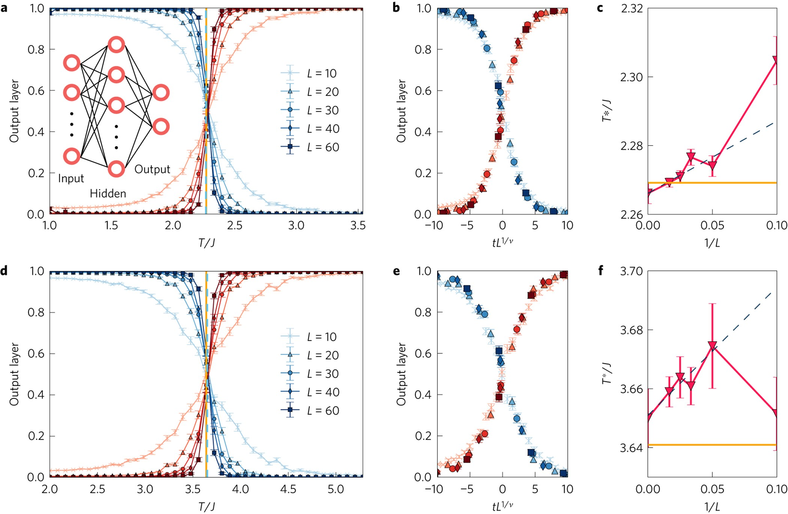

---

### Identifying Phase Transitions[^melko]
 <!-- .element width="65%" -->

---

### Renormalizing Images [`[1]`](https://arxiv.org/abs/1807.10250), [`[2]`](https://arxiv.org/abs/1410.3831)

<grid drag="100 60" drop="0 12" flow="col" align="center">

<grid drag="100 40" drop="0 0" flow="row" align="top">
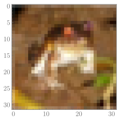 <!-- .element style="width:45%;margin-left:15%;" -->
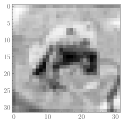 <!-- .element style="width:45%;margin-right:15%;" -->
</grid>

<grid drag="100 40" drop="0 28" flow="row" align="bottom">
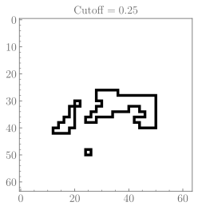 <!-- .element style="width:70%;" -->
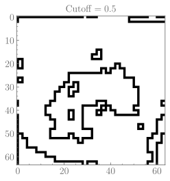 <!-- .element style="width:70%;" -->
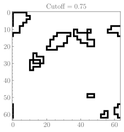 <!-- .element style="width:70%;" -->
</grid>
</grid>

<grid drag="95 0" drop="3 -17" align="left" class="horizontal_dotted_line">
</grid>

<grid drag="95 0" drop="0 -5" class="footer">
1. Foreman, S., Giedt, J., Meurice, Y., & Unmuth-Yockey, J. (2018). Examples of renormalization group transformations for image sets. _Physical Review E_, _98_(5), 052129.Foreman, S., Giedt, J., Meurice, Y., & Unmuth-Yockey, J. (2018). Examples of renormalization group transformations for image sets. Physical Review E, 98(5), 052129. [`arXiv:1807.10250`](https://arxiv.org/abs/1807.10250)
2. Mehta, P., & Schwab, D.J. (2014). An exact mapping between the Variational Renormalization Group and Deep Learning. [`arXiv:1410.3831`](https://arxiv.org/abs/1410.3831)
</grid>

note:
Hinton's "deep belief networks" works, in a particular case, exactly like the renormalization group and seems to be closely related to the "information bottleneck"

---

# Tensor Nets

<grid drag="100 100" drop="center" flow="col" align="stretch" style="margin-top:10%;">
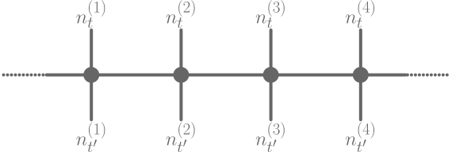 
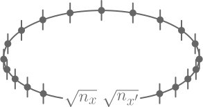
</grid>

---

# Standard Model

<grid drag="50 40" drop="5 15" align="topleft" style="font-size:0.8em;">
- Electricity & Magnetism, Strong and Weak Interactions, elementary particles

- QCD:
    - Theory of the **strong** interactions between quarks and gluons
    - ❌ Analytically intractable 
    - ✅ Discretize space-time onto lattice
</grid>

<grid drag="30 30" drop="55 15" align="topright">

</grid>

<grid drop="0 50" drag="100 50" align="stretch" style="margin-top:10%;">
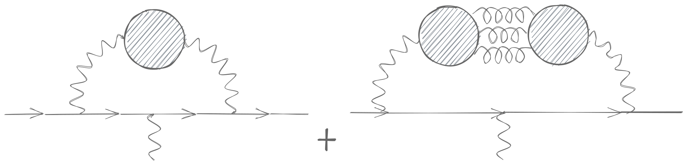
</grid>

note:
1. Background / Interesting Work
    - Why its interesting?
    - What I've learned
    - What aspects are relevant outside of domain expertise
2. Ongoing Work
     - Lattice QCD
     - Common history with HPC
     - Mutually beneficial
3. Plans for future research

---

<section data-background-video-loop data-background-video-muted data-background-video="https://d2r55xnwy6nx47.cloudfront.net/uploads/2021/04/Muon_2560_Lede.mp4">

#### Anomalous Magnetic Moment of the Muon <!-- .element style="color:#EEEEEE;vertical-align:center;margin-top:10%;text-shadow:0px 0px 10px black;" -->

<grid drag="40 20" drop="center" align="center" class="note">
$$a_{\mu} = \frac{(g_{\mu} - 2)}{2}$$ <!-- .element style="color:#EEEEEE;font-size:1.5em;text-shadow:0px 0px 10px black;" -->
</grid>

<grid drop="0 60" drag="100 40" align="center" style="text-align:center;">

#### New physics? <!-- .element style="color:#f8f8f8;;vertical-align:center;margin-top:10%;text-shadow:0px 0px 10px black;" -->
</grid>
</section>

note:
muon g-2

---

<!-- .slide style="text-align:left;font-size:1.1em;" -->

### Muon $g-2$ from Lattice QCD

- From BNL [`[1]`](https://arxiv.org/abs/2002.12347):

::: block <!-- .element style="text-align:center!important;margin-left:10%;margin-right:10%;border:1px solid white;margin-top:5%;margin-bottom:5%;" align="center" class="note"-->

$$a_{\mu}^{\mathrm{exp}} = 11659209.1(5.4)(3.3)\times 10^{-10}$$

:::

- Hunt for Beyond Standard Model (BSM) physics
    - Upcoming experiments at Fermilab and JPARC aim to reduce uncertainty by factor of four

<grid drag="90 0" drop="5 73" class="horizontal_dotted_line">
</grid>
<grid drag="90 5" drop="3 75" align="left" class="footer">
::: block

1. Leading hadronic contribution to the muon magnetic moment from lattice QCD [arXiv:2002.12347](https://arxiv.org/abs/2002.12347)

:::
</grid>

note:
- Lattice QCD historically has been in lock-step with developments in HPC 

---

# Contributions

- Calculate using first principles from Lattice QCD (LQCD)
- LQCD _may_ be able to resolve the current tension between the standard models' experiments and predictions

 <!-- .element align="center" -->

<split even>
::: block <!-- .element class="note" style="margin-right:10%;margin-left:2%;font-size:0.8em;" align="top" -->

<u>**One Photon Correction**</u> <!-- .element style="color:#888888;" -->

$\mu$ emits and reabsorbs a virtual photon (largest effect) 

:::

::: block <!-- .element class="note" style="margin-right:2%;font-size:0.8em;" -->

<u>**Hadronic Vacuum Polarization**</u> <!-- .element style="color:#888888;" -->

Virtual photon splits into (anti)-hadron pair (quarks, hard to calculate)

:::
</split>

note:
- Hadronic Vacuum Polarization (HVP) Contribution
- The blobs (quark loops) represent all possible intermediate hadronic states ($\rho$, $\pi\pi$, $\ldots$)
  - Not calculable in perturbation theory
- Can be calculated from:
   - First principles using **lattice QCD**
$$a_{\mu}(\mathrm{HVP}) = \left(\frac{\alpha}{\pi}\right)^{2}\int_{0}^{\infty} dq^{2}\, f(q^{2}) \hat{\Pi}(q^{2})$$ <!-- .element style="text-align:center!important;" -->

---

## Lattice QCD

- Non-perturbative approach to solving the QCD theory of the strong interaction between quarks and gluons.
- Calculations in LatticeQCD proceed in 3 steps:

::: block <!-- .element class="note" bg="#66BB6A" style="border:1px solid #66BB6A" -->

  1. **Gauge Field Generation**: Use Markov Chain Monte Carlo (MCMC) methods for sampling _independent_ gauge field (gluon) configurations. 

:::

  2. **Propagator calculations**: Compute how quarks propagate in these fields
     (_quark propagators_)
  3. **Contractions**: Method for combining quark propagators into correlation
     functions and observables.

---

# More statistics!

- Lattice QCD _may_ help resolve this tension
- Currently limited by computing power
- New algorithms + ML seem promising...
- See [`[1]`](https://arxiv.org/abs/2202.05838) for a broad overview of prospects

<grid drag="100 0" drop="0 -13" class="horizontal_dotted_line" align="bottom">
</grid>

<grid drag="100 10" drop="bottom" align="topleft" class="footer">

1. [Applications of Machine Learning to Lattice Quantum Field Theory arXiv:2202.05838](https://arxiv.org/abs/2202.05838)
</grid>

note:
- LQCD may help resolve the existing tension between the standard model predictions and experiments
- For many key applications the necessary LQCD calculations are limited by available computing resources

---

## ALCF (2008)

<grid drag="80 75" drop="center" style="font-size:0.6em;text-align:left!important;">
> The **Blue Gene/P** at the ALCF has tremendously accelerated the generation of the gauge configurations—in many cases, by a factor of 5 to 10 over what has been possible with other machines.
> Significant progress has been made in simulations with two different implementations of the quarks—domain wall and staggered. [`[1]`](https://publications.anl.gov/anlpubs/2009/12/65724.pdf)
</grid>

<grid drag="97 0" drop="2 89" class="horizontal_dotted_line" align="bottom">
</grid>

<grid drag="97 10" drop="2 90" align="topleft" style="font-size:80%;">

1. [Argonne Leadership Computing Facility • 2008 annual report](https://publications.anl.gov/anlpubs/2009/12/65724.pdf)

</grid>

---
<!-- .slide style="vertical-align:center;" -->

# BMW Collaboration

<grid drop="left" drag="100 100" align="center">
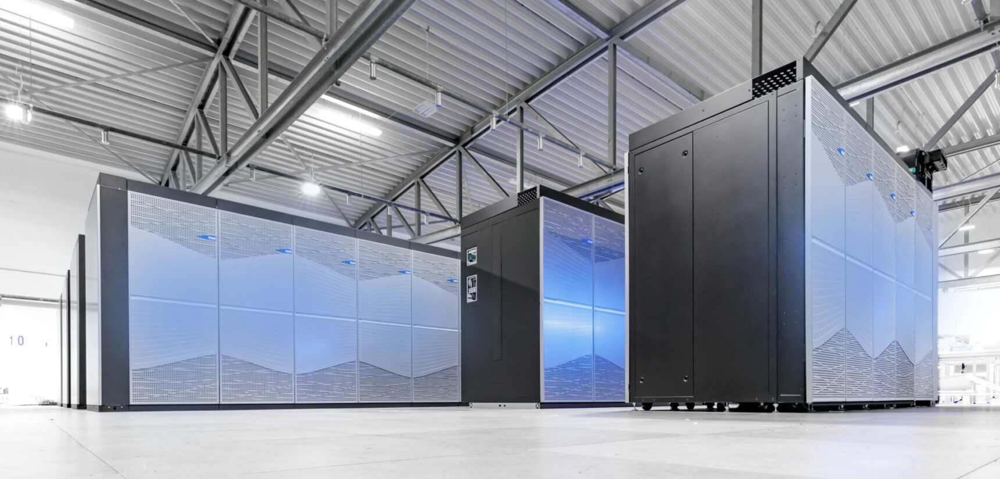 
</grid>

<grid drag="97 0" drop="2 89" class="horizontal_dotted_line" align="bottom">
</grid>
<grid drag="97 10" drop="2 90" align="topleft" style="font-size:80%;">

::: block <!-- .element class="footer" -->

2. The JUWELS supercomputer at the Jülich Research Center in Germany, used to calculate the anomalous magnetic moment of the muon

:::

</grid>

---

# <a href="https://www.github.com/saforem2/l2hmc-qcd"><i class="fab fa-github" /></a> `l2hmc-qcd`
    
:::  block

   
 
  
 
 
 

 

:::

---

#### Markov Chain Monte Carlo (MCMC)

$$x \sim \mathcal{N}(0, \mathbb{1})$$
 <!-- .element align="stretch" width="80%" -->

---

#### Markov Chain Monte Carlo (MCMC)

<grid drag="100 85" drop="0 15" flow="col">
<grid drag="100 35" drop="0 15" flow="row">

</grid>
<grid drag="100 35" drop="0 65" flow="row">

</grid>
</grid>

---

<!-- .slide style="text-align: center;" -->

### Hamiltonian Monte Carlo (HMC)

<grid drag="32 27" drop="33 15" align="center" class="note" style="font-size:1.5em;margin-bottom:20%;">
$$\begin{align}
    \dot{x} &= +\partial_{v} H \\\\
    \dot{v} &= - \partial_{x} H 
\end{align}$$
</grid> 

<grid drag="100 100" drop="0 40" align="stretch">
 <!-- .element align="bottom" -->
</grid>

---

<section data-background-iframe="https://chi-feng.github.io/mcmc-demo/app.html" data-background-interactive></section>

<grid drag="20 20" drop="center" align="center">

# HMC <!-- .element style="text-shadow: 0px 0px 10px black;" -->
</grid>

---

# Issues with HMC

 <!-- .element align="stretch" -->
 <!-- .element align="stretch" -->

---

# L2HMC

 <!-- .element align="stretch" -->

note:
- Generic MCMC algorithm, designed to encourage efficient exploration of target space

---

# Critical Slowing Down 

::: block <!-- .element style="font-size:1.25em;line-height:1.75em;" -->

<h6>Charge Freezing</h6>

- $Q$ gets stuck!

 

- $\delta Q \longrightarrow 0$  

 

- need to wait $N_{\mathrm{configs}}\longrightarrow \infty$

 
$\tau_{\mathrm{int}}^{Q} \longrightarrow \infty$

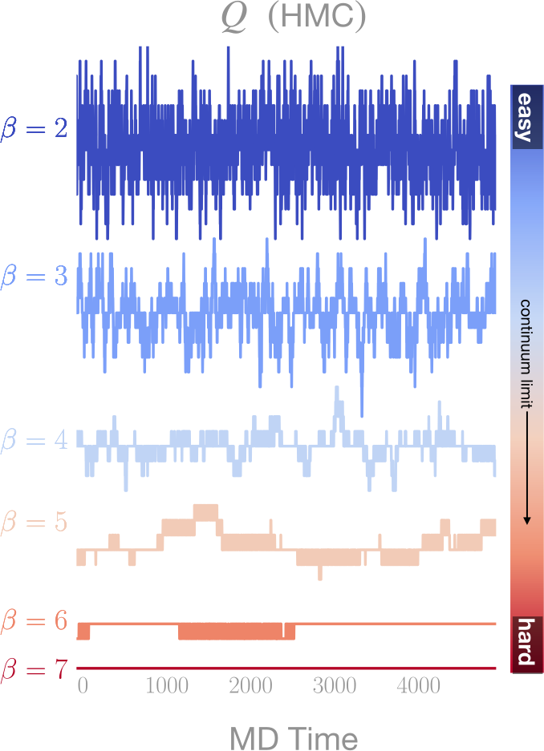

:::

---

<!-- .slide style="text-align:left;" -->

# Motivation

- For independent samples: 

    $$\langle \mathcal{O}\rangle \propto\int\left[\mathcal{D}x\right]\mathcal{O}(x)e^{-S(x)} \simeq\frac{1}{N}\sum_{n=1}^{N}\mathcal{O}(x_{n})$$

    $$\Rightarrow \sigma^{2}=\frac{1}{N}\text{Var}\left[\mathcal{O}(x\right)]$$

- Accounting for autocorrelations:

    $$\sigma^{2}=\frac{\textcolor{#0091ea}{\tau_{\mathrm{int}}^{\mathcal{O}}}}{N}\text{Var}\left[\mathcal{O}(x)\right]$$ <!-- .element style="text-align:center!important;" -->

- $\tau_{\mathrm{int}}^{\mathcal{O}}$ is known to scale exponentially as we approach physical lattice spacing.

---

### `l2hmc`: LeapfrogLayer

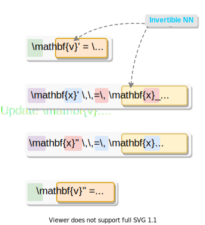</img>
</img>
</img>

---

<!-- .slide style="text-align:left;font-size:0.78em;" -->

## Algorithm

1. `input`: $\textcolor{#AE81FF}{x}$

2. Resample $\textcolor{#FD971F}{\mathbf{v}} \sim \mathcal{N}(0, \mathbb{1})$

3. construct $\textcolor{#FF5252}{\xi} = (\textcolor{#AE81FF}{x}, \textcolor{#FD971F}{\mathbf{v}})$

4. Generate proposal $\xi^{\ast}$ by passing initial $\xi$ through $N_{\mathrm{LF}}$ **leapfrog layers**:

::: block <!-- .element align="center" style="text-align:center!important;margin-left:20%;padding:0.5%; margin-right:20%;" class="note" -->

  $\textcolor{#FF5252}{\xi}\hspace{1pt}\xrightarrow[\mathrm{LFL}]{}\xi_{1} \longrightarrow\cdots \longrightarrow \xi_{N_{\mathrm{LF}}} = \textcolor{#0091ea}{\xi^{\ast}}$ 

:::

3. Compute the **Metropolis-Hastings** (MH) acceptance (with Jacobian $\mathcal{J}$) 

::: block <!-- .element align="center" style="text-align:center!important;margin-left:10%; padding:0.5%;margin-right:10%;" class="note" -->

$A(\textcolor{#0091ea}{\xi^{\ast}}|\textcolor{#ff5252}{\xi})=\mathrm{min}\left[1, \frac{p(\textcolor{#0091ea}{\xi^{\ast}})}{p(\textcolor{#ff5252}{\xi})}\mathcal{J}\left(\textcolor{#0091ea}{\xi^{\ast}},\textcolor{#ff5252}{\xi}\right)\right]$

:::

4. `if training`: 

  1. Evaluate the **loss function** $\mathcal{L}\gets \mathcal{L}_{\theta}(\textcolor{#ff5252}{\xi^{\ast}}, \textcolor{#ff5252}{\xi})$ and backprop

  2. Evaluate MH criteria and assign the next state in the chain by 

::: block <!-- .element align="center" style="text-align:center!important;margin-left:20%;padding:0.5%; margin-right:20%;" class="note" -->

$\mathbf{x}_{i+1}\gets \begin{cases} \textcolor{#0091ea}{\mathbf{x}^{\ast}} \small{\text{ w/ prob }} A(\textcolor{#ff5252}{\xi^{\ast}}|\textcolor{#0091ea}{\xi}) \hspace{26pt}✅ \\\\ \textcolor{#ff5252}{\mathbf{x}} \hspace{14px}\small{\text{ w/ prob }} 1 - A(\textcolor{#ff5252}{\xi^{\ast}}|\textcolor{#0091ea}{\xi}) \hspace{11pt}❌ \end{cases}$

:::

---

### Lattice Gauge Theory

##### <b><u> Link variables</u></b>
   $U_{\mu}(x) = e^{i x_{\mu}(n)}\in U(1)$,  with `\(x_{\mu}(n)\in[-\pi,\pi]\)`  
##### <b><u>Wilson Action</u></b></h5>
   `\(S_{\beta}(x)
  = \beta\sum_{P} 1 - \cos \textcolor{#0091Ea}{x_{P}}\)`
  `\(x_{P}= x_{\mu}(n) + x_{\nu}(n+\hat{\mu})-x_{\mu}(n+\hat{\nu})-x_{\nu}(n)\)`

<grid drag="48 48" drop="topright" align="center" style="margin-top:9%!important;margin-right:15%!important;">

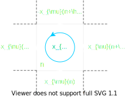 <!-- .element width="100%" style="margin-top:10%;" -->
</grid>

::: block

<h5><b><u>Topological Charge</u></b></h5>

**Continuous:**  $Q_{\mathbb{R}} = \frac{1}{2\pi}\sum_{P} \sin x_{P}\in\mathbb{R}$ 

$\hspace{10pt}$  **Discrete:** $Q_{\mathbb{Z}} = \frac{1}{2\pi}\sum_{P} \left\lfloor x_{P}\right\rfloor\hspace{18px}\in\mathbb{Z}$

$\hspace{45pt}$ with $\left\lfloor x_{P}\right\rfloor = x_{P}-2\pi\left\lfloor\frac{x_{P}+\pi}{2\pi}\right\rfloor$

:::

---

# Networks

- Stack gauge links as `x.shape = [Nb, 2, Nt, Nx, 2]`

::: block <!-- .element style="text-align:center!important;" -->

$$x_{\mu}(n) \gets \left[\cos(x), \sin(x)\right]$$

:::

- $x$ network: 

  - $\Lambda^{\pm}$ $(x, v) \rightarrow \left[S_{x}, T_{x}, Q_{x}\right]$

  - $S_{v}, T_{v}, Q_{v}$ used to update $v$ L2HMC update

- $v$ network: 

  - $\Gamma^{\pm}$ $(x, \partial_{x}U) \rightarrow \left[S_{v}, T_{v}, Q_{v}\right]$

  - $S_{x}, T_{x}, Q_{x}$ used to update $x$ L2HMC update

---

<!-- .slide style="text-align:center;" -->

# $x$ Networks $\textcolor{#42A5F5}{\Lambda^{\pm}}$:

::: block <!-- .element class="note" style="margin-left:25%;margin-right:25%;padding:1%;" -->

`input`: $(\textcolor{#42A5F5}{x}, \textcolor{#FD971F}{v})$ 

:::

::: block

$$\begin{align}
h_{1} &= \sigma\left(W_{x}\, \textcolor{#42A5F5}{x} + W_{v}\, \textcolor{#FD971F}{v} + b\right) \\\\
h_{2} &= \sigma\left(W_{1} h_{1} + b_{1}\right) \\\\
\quad\vdots& \\\\
h_{n} &= \sigma\left(W_{n} h_{n} + b_{n}\right) \\\\
\textcolor{#00CF53}{S_{x}} &= \textcolor{#ff5252}{\lambda_{S}}\tanh\left(W_{S} h_{n} + b_{S} \right) \\\\
\textcolor{#00CF53}{Q_{x}} &= \textcolor{#ff5252}{\lambda_{Q}}\tanh\left(W_{Q} h_{n} + b_{Q} \right) \\\\
\textcolor{#00CF53}{T_{x}} &= W_{T} h_{n} + b_{T}
\end{align}$$

:::

::: block <!-- .element class="note" style="margin-left:25%;margin-right:25%;padding:1%;" -->

`output`: $\textcolor{#00CF53}{S_{x}, T_{x}, Q_{x}}$ 

:::

<grid drag="100 10" drop="0 88" align="center" class="footer">
**Note**: $\textcolor{#ff5252}{\lambda_{S}}$, $\textcolor{#ff5252}{\lambda_{Q}}$ are trainable parameters
</grid>

---

## Loss Function

::: block <!-- .element style="text-align:left;" -->

- Maximize the _expected squared charge difference_: 

::: block <!-- .element class="note" style="text-align:center!important;margin-left:20%;margin-right:20%;padding:0.1%;" -->

$$\mathcal{L}(\theta) = \textcolor{#228BE6}{\mathbb{E}_{p(\xi)}}\left[-\textcolor{#FA5252}{{\delta Q}}^{2}_{\textcolor{#FA5252}{\mathbb{R}}}(\xi', \xi)\cdot A(\xi'|\xi)\right]$$ 

:::

- $\textcolor{#FA5252}{\delta Q_{\mathbb{R}}}$ is the tunneling rate 

::: block <!-- .element class="note" style="text-align:center!important;margin-left:20%;margin-right:20%;padding:0.1%;" -->

$$\textcolor{#FA5252}{\delta Q_{\mathbb{R}}}(\xi',\xi)=\left|Q_{\mathbb{R}}(x') - Q_{\mathbb{R}}(x)\right|$$

:::

- $A(\xi'|\xi)$ is probability of accepting the proposal $\xi'$.

::: block <!-- .element class="note" style="text-align:center!important;margin-left:20%;margin-right:20%;padding:0.1%;" -->

$$A(\xi'|\xi) = \min\left(1, \frac{p(\xi')}{p(\xi)}\left|\frac{\partial \xi'}{\partial \xi^{T}}\right|\right)$$

:::

:::

---

### HMC Sweep

::: block <!-- .element style="font-size:0.75em!important;margin-bottom:-3%;" -->

- Run HMC Sweep with $N_{\mathrm{LF}}=16$ on $16\times16$ lattice at $\beta = 4$

- **Goal**: Maximize $\delta Q_{\mathbb{Z}} = f(N_{\mathrm{LF}}, \textcolor{#66bb6a}{\varepsilon})$  over _thermalized_ configs
    - Fix $N_{\mathrm{LF}}$
    - Sweep over $\textcolor{#66bb6a}\varepsilon$

:::
 <!-- .element align="stretch" style="align:center!important;text-align:center!important;width:100%;" -->

---
## Comparison

::: block <!-- .element style="font-size:0.9em;" -->

- Maintain a buffer of:
  - $N_{\mathrm{b}}$ chains ran to generate $M$ configurations (accept/reject steps)
- To calculate averages, we drop the first $\sim 25\\%$ of chains (thermalize), and average

$$\langle \delta Q_{\mathbb{Z}}\rangle = \frac{1}{N_{b}}\sum_{n=1}^{N_{b}}\bigg\{\frac{1}{M}\sum_{m=1}^{M} \left|Q'_{\mathbb{Z}} - Q_{\mathbb{Z}}\right|\bigg\}$$

:::

<split even>

</split>

::: block <!-- .element class="footer" -->

Comparison of the tunneling rate between trained model (left) and HMC (right) (**Note**: Higher is better)

:::

---

<!-- .slide bg="white" -->
<grid drop="0 0" drag="100 100">
<iframe width="100%" height="100%" data-src="https://wandb.ai/l2hmc-qcd/l2hmc-qcd/reports/L2HMC-Report-04-04-2022---VmlldzoxNzgzODcx" style="border:none;width:100%" data-preload data-background-interactive></iframe>
</grid>

---

<!-- .slide bg="white" -->

<grid drop="0 0" drag="100 100">
<iframe width="100%" height="100%" data-src="https://wandb.ai/l2hmc-qcd/l2hmc-qcd/reports/W-B-Sweep-1024x16x16-4-nlf-8-TensorFlow---VmlldzoxNzA1MzU4" style="border:none;width:100%" data-background-interactive></iframe>
</grid>

---

#### Integrated Autocorrelation time: $\textcolor{#FF2052}{\tau_{\mathrm{int}}}$

<grid drop="0 5" drag="40 65" align="center" style="text-align:right!important;">

We can measure the performance by comparing $\tau_{\mathrm{int}}^{Q}$ for the **trained model** to  **HMC**.

::: block <!-- .element class="footer" style="color:#757575;text-align:right!important;font-size:1.0em;" align="bottomright" -->
    
**Note**: Lower is better <!-- .element style="text-align:right!important;" -->
    
:::

</grid>

<grid drop="40 10" drag="60 65" align="topleft" style="">

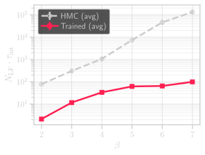
</grid>

<grid drop="0 75" drag="95 23" align="center" style="">

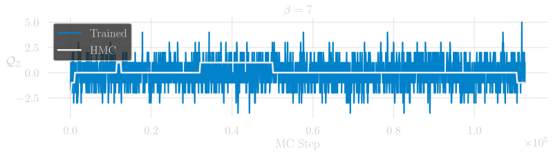
</grid>

---

### Integrated Autocorrelation Time

::: block <!-- .element class="footer" -->

Comparison of $\tau_{\mathrm{int}}^{Q}$ for **trained models**  vs **HMC**  with different trajectory lengths, $N_{\mathrm{LF}}$, at $\beta = 4, 5, 6, 7$

:::

---
# Interpretation

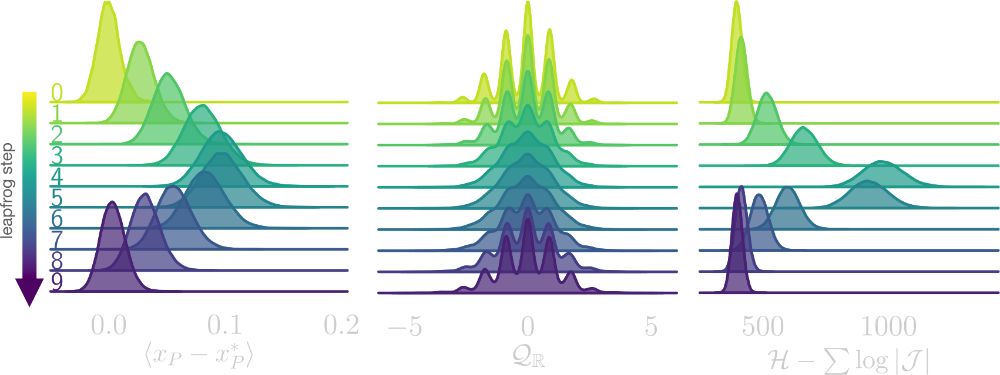 <!-- .lement align="stretch" -->

::: block <!-- .element style="font-size:0.7em;color:#757575;" -->

<grid drop="5 65" drag="30 10" align="center" class="note">
Deviation in $x_{P}$ 
</grid>

<grid drop="38 65" drag="30 10" align="center" class="note">
Topological charge mixing
</grid>

<grid drop="70 65" drag="30 10" align="center" class="note">
Artificial influx of energy
</grid>

:::

<grid drag="100 15" drop="0 80" align="bottom">
Illustration of how different observables evolve over a single L2HMC trajectory.
</grid>

---

# Interpretation

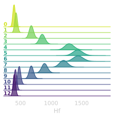 <!-- .element width="62%" align="top" -->
</grid>

---

# Interpretation
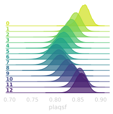 <!-- .element width="62%" align="stretch" -->

---

## Plaquette analysis: $x_{P}$

<grid drag="100 50" drop="center" align="stretch">
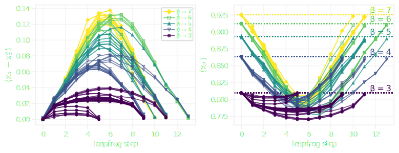
</grid>

---
# <a href="https://www.github.com/saforem2/l2hmc-qcd"><i class="fab fa-github" /></a> `l2hmc-qcd` 
  

- Source code publicly available

- Both `pytorch` and `tensorflow` implementations with support for distributed training, automatic checkpointing, etc.

- Generic interface, easily extensible

- <b>Work in progress</b> scaling up to 2D, 4D $SU(3)$

---

# References

[^melko]: Carrasquilla, J., Melko, R. [Machine learning phases of matter](https://doi.org/10.1038/nphys4035). _Nature Phys_ **13,** 431–434 (2017).
[^alcf]: [Argonne National Laboratory and Hewlett Packard Enterprise prepare for exascale era with new testbed supercomputer Argonne Leadership Computing Facility](https://www.alcf.anl.gov/news/argonne-national-laboratory-and-hewlett-packard-enterprise-prepare-exascale-era-new-testbed)

---

<grid drag="50 30" drop="center">
# Thank you!
Feel free to reach out!
[foremans@anl.gov](mailto:///foremans@anl.gov)
</grid>

<grid drag="100 30" drop="bottom" align="top" flow="row" style="font-size:2.0em;margin-bottom:10%;">
::: block 

[<i class="fab fa-github"></i>](https://github.com/saforem2) <!-- .element style="margin:5%;" -->
[<i class="fas fa-paper-plane"></i>](https://github.com/saforem2) <!-- .element style="margin:5%;" -->
[<i class="fas fa-home"></i>](https://samforeman.me) <!-- .element style="margin:5%;" -->
[<i class="fab fa-twitter"></i>](https://twitter.com/saforem2) <!-- .element style="margin:5%;" -->

:::

</grid>

---

<grid drag="85 40" drop="center" class="note">
# BACKUPS
</grid>

---

### `l2hmc`: LeapfrogLayer

<split even>
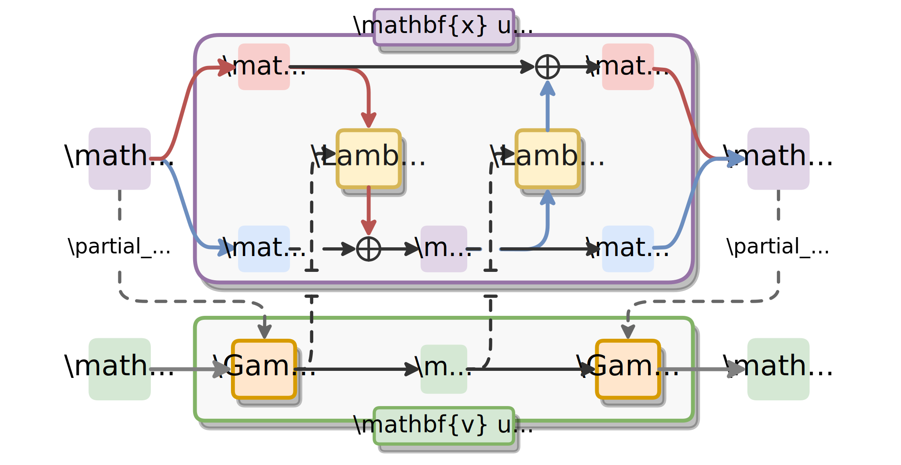 <!-- .element align="right" style="margin-left:20%;margin-right:-20%;margin-top:10%;"-->

</split>

---

<!-- .slide style=""="text-align:left;line-height:2.0em;font-size:2.0em;" -->

## Algorithm

1. `input:` $x$ (lattice configuration)

2. $v\sim\mathcal{N}(0, \mathbb{1})$

3. $(x'',v'') \gets \texttt{TransitionKernel}(x, v)$:

    1. $v' = \textcolor{#ff5252}{\Gamma^{\pm}}\left[x, \partial_{x}U\right]$

    2. Update $x$ in two parts:

        $$\begin{align}
        x' &= m_{A}\odot x + m_{B}\odot\textcolor{#0091ea}{\Lambda^{\pm}}\left[x, v'\right]\\\\
        x'' &= m_{B}\odot x' + m_{A}\odot \textcolor{#0091ea}{\Lambda^{\pm}}\left[x', v'\right]
        \end{align}$$ <!-- .element align="center" -->

   3. $v'' = \textcolor{#ff5252}{\Gamma^{\pm}}\left[x'', \partial_{x}U''\right]$

---

<!-- .slide style="font-size:80%;" -->

# Detail

::: block <!-- .element style="text-align:left;" -->

1. **Update** $v$:

$$v' = v \cdot \exp\left[\varepsilon \textcolor{#ff5252}{S_{v}}\left(x, \partial_{x}U\right)\right] - \frac{\varepsilon}{2} \bigg[\partial_{x} U\cdot \exp\left[\varepsilon \textcolor{#ff5252}{Q_{v}}\left(x, \partial_{x}U\right)\right] + \textcolor{#ff5252}{T_{v}}\left(x, \partial_{x}U\right)\bigg]$$
<!-- .element style="text-align:center!important;font-size:0.9em;" -->

2. **Update** $x$ (in two parts):
<!-- .element style="text-align:left!important;" -->

   Update first half of $x$: 
<!-- .element style="text-align:left!important;" -->
  $$x' = x_{A} + \bigg\{x_{B}\cdot\exp\left[\varepsilon \textcolor{#00CCFF}{S_{x}}(x_{B}, v')\right] + \varepsilon\cdot\big[v'\cdot \exp\left[\varepsilon \textcolor{#00CCFF}{Q_{x}}\left(x_{B}, v'\right)\right] + \textcolor{#00CCFF}{T_{x}}\left(x_{B}, v'\right)\big]\bigg\}$$
<!-- .element style="text-align:left!important;font-size:0.9em;" -->
  Update second half of $x$: 
<!-- .element style="text-align:left!important;" -->
  $$x'' = x'_{B} + \bigg\{x'_{A}\cdot\exp\left[\varepsilon \textcolor{#00CCFF}{S_{x}}(x'_{A}, v')\right] + \varepsilon\cdot\big[v'\cdot \exp\left[\varepsilon \textcolor{#00CCFF}{Q_{x}}\left(x'_{A}, v'\right)\right] + \textcolor{#00CCFF}{T_{x}}\left(x'_{A}, v'\right)\big]\bigg\}$$
<!-- .element style="text-align:left!important;font-size:0.9em;" -->

3. **Update** $v$:
<!-- .element style="text-align:left!important;" -->
$$v'' = v' \cdot \exp\left[\varepsilon \textcolor{#ff5252}{S_{v}}\left(x'', \partial_{x}U\right)\right] - \frac{\varepsilon}{2} \bigg[\partial_{x} U\cdot \exp\left[\varepsilon \textcolor{#ff5252}{Q_{v}}\left(x'', \partial_{x}U''\right)\right] + \textcolor{#ff5252}{T_{v}}\left(x'', \partial_{x}U''\right)\bigg]$$ 
<!-- .element style="text-align:right!important;font-size:0.9em;" -->

:::

---

# Gauge Equivariance

::: block <!-- .element style="text-align:left!important;" -->

- Transform untraced plaquettes (matrix valued) $P'_{\mu\nu}(x)\gets P_{\mu\nu}(x)$

$$P_{\mu\nu}(x) \equiv U_{\mu}(x)\,U_{\nu}(x+\hat{\mu})\,U^{\dagger}(x+\hat{\nu})\,U^{\dagger}(x)$$ 
<!-- .element class="note" style="text-align:center!important;background-color:#35353550;margin-top:5%;margin-bottom:5%;margin-left:10%;margin-right:10%;" -->

- Change back to links and update gauge configuration 

$$U'_{\mu}(x) = P'_{\mu\nu}(x)P^{\dagger}_{\mu\nu}(x)U_{\mu}(x)$$
<!-- .element class="note" style="text-align:center!important;margin-top:5%;background-color:#35353550;margin-bottom:5%;margin-left:20%;margin-right:20%;" -->

:::

---

<!-- .slide style="text-align:left;" -->

### Topological Charge

Discretize $Q$ on the lattice as 
$$Q = a^{4} \sum_{x} q_{L}(x)$$

Discretize $q_{L}$ using $C_{\mu\nu}^{\mathrm{plaq}}(x)$

$$q_{L}^{\mathrm{plaq}} = \frac{1}{32\pi^{2}} \varepsilon_{\mu\nu\rho\sigma}\mathrm{Tr}\left(C_{\mu\nu}^{\mathrm{plaq}} C_{\rho\sigma}^{\mathrm{plaq}}\right)$$

Where $C_{\mu\nu}^{\mathrm{plaq}}(x)$ is the imaginary part of the plaquette:

 <!-- .element width="50%" align="center" style="align:center!important;margin-left:20%;margin-right:20%;;" -->

---

<!-- .slide style="text-align:left;" -->

## Topological Charge $Q$

**Field Theoretic Definition**:

$$Q = \int d^{4}x q(x)$$

where

$$q(x) = \frac{1}{32\pi^{2}} \varepsilon_{\mu\nu\rho\sigma} \mathrm{Tr}\left[F_{\mu\nu} F_{\rho\sigma}\right]$$

---

<!-- .slide style="text-align:left;font-size:100%;" -->

#### Center for Complex Systems Research @ UIUC

::: block <!-- .element style="max-width:30;" -->

- [Alfred Hübler](https://en.wikipedia.org/wiki/Alfred_H%C3%BCbler) [`[1]`](https://nosh.northwestern.edu/conferences/schedule.pdf)
    - Neural nets in 2006! [`[2]`](https://meetings.aps.org/Meeting/MAR06/Event/42791)

- Energy conversion, storage 

- Resulted in a publication [`[3]`](https://doi.org/10.1063/1.5009698)

- And a patent! [`[4]`](https://experts.illinois.edu/en/publications/energy-storage-in-quantum-resonators)

:::

<grid drop="60 10" drag="35 35" align="topright" style="">

</grid>

<grid drag="97 0" drop="3 52" class="horizontal_dotted_line">
</grid>

<grid drag="95 10" drop="3 60" align="left" class="footer">

::: block

1. [Understanding Complex Systems Workshop 2004](https://nosh.northwestern.edu/conferences/schedule.pdf)
2. [2006 APS March Meeting - Scaling Properties of Topological Neural Nets](https://meetings.aps.org/Meeting/MAR06/Event/42791)
3. A. Hubler, **S. Foreman**, J. Liu, & L. Wortsmann <a href="https://doi.org/10.1063/1.5009698"><b>Large Energy Density in Three-Plate Nanocapacitors due to Coulomb Blockade</b></a> <i>J. Appl. Phys</i>, 2018
4. Liu, Jiaqi; Hubler, Alfred W; **Foreman, Samuel A**; Ott, Katharina. [**Energy storage in quantum resonators**](https://experts.illinois.edu/en/publications/energy-storage-in-quantum-resonators) U.S. Patent No.: _9741492_. Aug 22, 2017.

:::

</grid>

note:
- Heavily influenced my trajectory

---

## [<i class="fab fa-github"></i>](https://www.github.com/quda/quda) QUDA 

Multi-GPU Support[`[1]`](https//arxiv.org/1109.2935/abs), with:
  - adaptive multigrid[`[2]`](https//arxiv.org/abs/2104.05615)
  - block CG[`[3]`](https://arxiv.org/abs/1710.09745)
  - the Möbius MSPCG solver[`[4]`](https://arxiv.org/1612.07873)

<grid drag="90 0" drop="5 53" class="horizontal_dotted_line" align="bottom">
</grid>

<grid drag="90 60" drop="5 55" class="footer" align="topleft" style="font-size:0.5em;">

1. R. Babich, M. A. Clark, B. Joo, G. Shi, R. C. Brower, and S. Gottlieb, "Scaling lattice QCD beyond 100 GPUs," International Conference for High Performance Computing, Networking, Storage and Analysis (SC), 2011 [arXiv:1109.2935[hep-lat]](https://arxiv.org/1109.2935/abs).

2. Jiqun Tu, M. A. Clark, Chulwoo Jung, Robert Mawhinney, "Solving DWF Dirac Equation Using Multi-splitting Preconditioned Conjugate Gradient with Tensor Cores on NVIDIA GPUs," published in the Platform of Advanced Scientific Computing (PASC21) [arXiv:2104.05615[hep-lat]](https://arxiv.org/abs/2104.05615).

3. M. A. Clark, A. Strelchenko, A. Vaquero, M. Wagner, and E. Weinberg, "Pushing Memory Bandwidth Limitations Through Efficient Implementations of Block-Krylov Space Solvers on GPUs," Comput. Phys. Commun. 233 (2018), 29-40 [arXiv:1710.09745 [hep-lat]](https://arxiv.org/abs/1710.09745).

4. M. A. Clark, B. Joo, A. Strelchenko, M. Cheng, A. Gambhir, and R. Brower, "Accelerating Lattice QCD Multigrid on GPUs Using Fine-Grained Parallelization," International Conference for High Performance Computing, Networking, Storage and Analysis (SC), 2016 [arXiv:1612.07873 [hep-lat]](https://arxiv.org/1612.07873).

5. M. A. Clark, R. Babich, K. Barros, R. Brower, and C. Rebbi, "Solving Lattice QCD systems of equations using mixed precision solvers on GPUs," Comput. Phys. Commun. 181, 1517 (2010) [arXiv:0911.3191 [hep-lat]](https://arxiv.org/abs/0911.3191).

</grid>

---

### $SU(3)$: Plaquettes

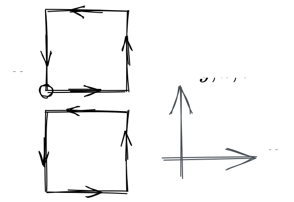 <!-- .element style="width=20%!important;" -->
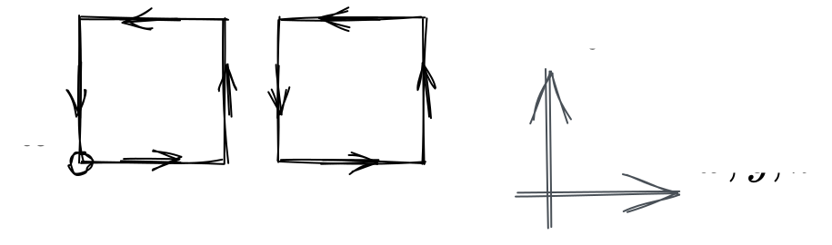 <!-- .element style="width=40%;" -->

---

## Probabilistic Generative Models
<grid drop="1 10"  drag="99 90">
<iframe id="lecun" width="100%" height="100%" data-src="https://twitter.com/ylecun/status/1525560489216028677" data-preload data-background-interactive></iframe>
</grid>

---

<!-- .slide style="text-align:left;" -->

## Non-Compact Projection[^1]

Project $x \in[-\pi, \pi]$ onto $\mathbb{R}$ using a transformation $z = g(x)$:

$$z = \tan\left(\frac{x}{2}\right) $$
<!-- .element align="center"style="margin-top:1em;margin-bottom:1em;" -->

Perform the update in $\mathbb{R}$:

$$ z' = m^{t}\odot z + \bar{m}^{t}\odot \left[\alpha z + \beta\right]$$
<!-- .element align="center"style="margin-top:1em;margin-bottom:1em;" -->

Project back to $[-\pi, \pi]$ using $x = g^{-1}(z)$:

$$ x = 2 \tan^{-1}(z) $$
<!-- .element align="center"style="margin-top:1em;margin-bottom:1em;" -->

[^1]: [arXiv:2002.02428](https://arxiv.org/abs/2002.02428)

---
<!-- .slide: data-background="#1c1c1c" -->

## Non-Compact Projection

[arXiv:2002.02428](https://arxiv.org/abs/2002.02428)

Combine into a single update:
$$x' = \textcolor{#228BE6}{m^{t}}\odot x + \textcolor{#FA5252}{\bar{m}^{t}}\odot\left[2\tan^{-1}\left(\alpha\tan\left(\frac{x}{2}\right)\right)+\beta\right]$$

With corresponding Jacobian:
$$ \frac{\partial x'}{\partial x} = \frac{\exp(\varepsilon s_{x})}{\cos^{2}(x/2)+exp(2\varepsilon s_{x})\sin(x/2)} $$

---

<!-- .slide style="text-align:left!important;" -->

### HMC: Leapfrog Integrator

- Hamiltonian: $H(x, v) = S(x) + \frac{1}{2} v^{2}$
- Target distribution: $\textcolor{#42a5f5}{p(x)\propto e^{-S(x)}}$, $p(v)$ $\propto e^{-\frac{1}{2}v^{2}}$  $\Longrightarrow$

$$p(x, v) \propto \textcolor{#42A5F5}{e^{-S(x)}} \cdot \textcolor{e^{-\frac{v^{2}}{2}}} = e^{-H(x, v)}$$
<!-- .element class="note" style="max-width:100%;margin-left:20%;margin-right:20%;" -->

- Hamilton's equations:

$$\dot{x} = \partial_{v} H,\quad \dot{v} = - \partial_{x} H$$
<!-- .element class="note" style="max-width:100%;margin-left:30%;margin-right:30%;" -->

- <u>Leapfrog Integrator </u> (step size $\varepsilon$)
<!-- .element align="left" style="margin-top:4%;font-weight:600;margin-bottom:-2%;" -->

::: block <!-- .element class="note" style="max-width:80%;margin-left:10%;margin-right:10%;line-height:1.5em;" -->

1. Half-step $\textcolor{#26A69A}{v}$ update: $\,\tilde{v} \,= v + \frac{\varepsilon}{2} \partial_{x} U$ <!-- .element style="color:#26A69A!important" --> 
2. Full-step $\,\textcolor{#AB47BC}{x}$ update: $x' = x + \varepsilon \tilde{v} $ <!-- .element style="color:#AB47BC!important;" --> 
3. Half-step $\textcolor{#26A69A}{v}$ update: $v' \,= \tilde{v} + \frac{\varepsilon}{2} \partial_{x} U$ <!-- .element style="color:#26A69A!important;" -->

:::

---

